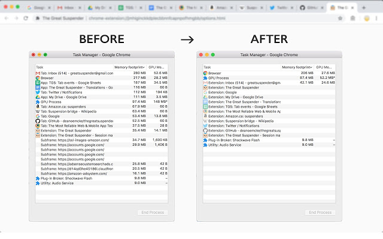
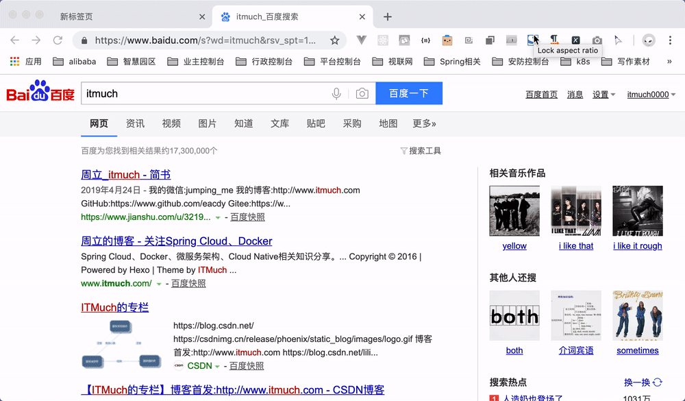
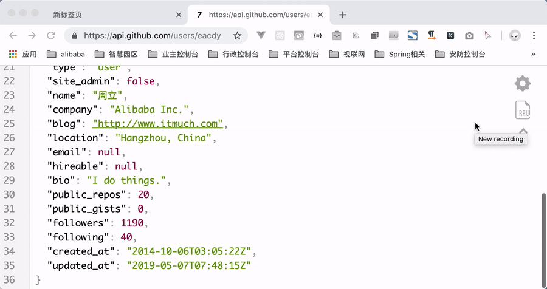

# Awesome Chrome Plugins

盘点那些好用的Chrome插件

## CrxMouse Chrome™ Gestures

**作用**：高度可自定义的鼠标手势、超级拖拽、鼠标滚轮手势、遥感手势，提升工作效率。

**官方网站**：<https://crxmouse.com/>

**插件主页**：`https://chrome.google.com/webstore/detail/crxmouse-chrome-gestures/jlgkpaicikihijadgifklkbpdajbkhjo`

**用户数**：525K

**Star数**：8036

**同类插件**：`Drag and Go`

**演示**：

## Merge Windows

**作用**：合并所有Chrome窗口，如下图

**官方网站**：<https://singleclickapps.com/merge-windows/>

**插件主页**： `https://chrome.google.com/webstore/detail/merge-windows/mmpokgfcmbkfdeibafoafkiijdbfblfg`

**用户数**：28K

**Star数**：113

**演示**：

## Tab Number

**作用**：长按cmd/alt/ctrl显示Tab的数目，便于使用ctrl/alt/cmd+number快捷键切换Tab，在Tab很多时，快速切换Tab非常高效。

**插件主页**：`https://chrome.google.com/webstore/detail/tab-number/fijaenjgknobfdombbdchngpamggajpm`

**用户数**：2081

**Star数**：43

**演示**：

## Keep Last Two Tabs

**作用**：总是为Chrome保持2个Tab，防止Chrome所有Tab被关闭时直接退出。

**插件主页**：`https://chrome.google.com/webstore/detail/keep-last-two-tabs/fcnmaiiahjldikaollhjobhchdbhfhgf`

**用户数**：7.8K

**Star数**：96

**演示**：

## The Great Suspender

**作用**：指定时长后（例如半天）某Tab未被操作/访问，则该Tab将被关闭，从而释放Chrome占用的资源。简单易用，并且高度可定制：例如指定时长、指定白名单等。

**插件主页**：`https://chrome.google.com/webstore/detail/the-great-suspender/klbibkeccnjlkjkiokjodocebajanakg`

**用户数**：1656K

**Star数**：4080

**演示**：

## Take Webpage Screenshots Entirely - FireShot

**作用**：将网页截图(支持**滚动截图**、区域截图)，并支持保存为PDF、发送邮件等，**还支持API调用哦**。

**插件主页**：`https://chrome.google.com/webstore/detail/take-webpage-screenshots/mcbpblocgmgfnpjjppndjkmgjaogfceg`

**用户数**：2287K

**Star数**：23771

**同类插件**：`Full Page Screen Capture`

**演示**：

## GitCodeTree

**作用**：相信Geekers对Octotree不会感到陌生——一款GitHub文件树插件，帮助我们在线阅读源码。本插件基于Octotree基础上开发，同时支持GitHub以及Gitee。

**官方网站**：<https://gitee.com/inu1255/GitCodeTree>

**插件主页**：`https://chrome.google.com/webstore/detail/gitcodetree/inaaldjpdbkaodlmdcplgpoibohcmmlj?hl=zh-CN`

**用户数**：7.9K

**Star数**：23

**同类插件**：`Octotree`

**演示**：

## JSON Viewer

**作用**：JSON美化工具

**官方网站**：<https://github.com/tulios/json-viewer>

**插件主页**：`https://chrome.google.com/webstore/detail/json-viewer/gbmdgpbipfallnflgajpaliibnhdgobh`

**用户数**：571K

**Star数**：784

**同类插件**：`JSON Formatter`

**演示**：

## XPath Helper

**作用**：在网页上轻松提取内容，并生成XPath查询语句，**精细爬虫工具必备**。

**插件主页**：`https://chrome.google.com/webstore/detail/xpath-helper/hgimnogjllphhhkhlmebbmlgjoejdpjl`

**用户数**：176K

**Star数**：543

**演示**：

